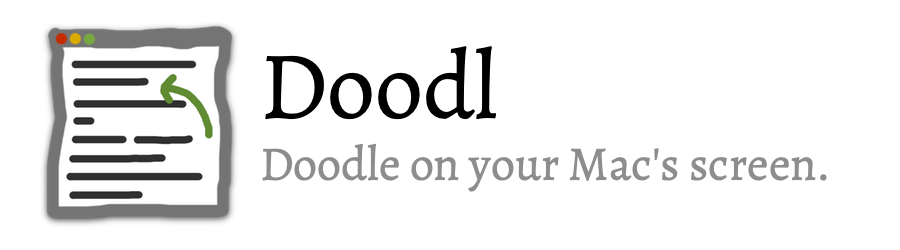

# Doodl
A simple MacOS App written in Swift, to draw temporary doodles on your screen.  Inspired by the doodles you can draw while screen sharing in a Slack call.

## Usage
Currently, the global hotkey is set to `⌘`+`⇧`+`D`, which will bring the application to the foreground for 2 seconds.  Once you start drawing, the timer is reset until you let up on your mouse button.  Your drawings will disappear in 1 second, but you have another second to start drawing again, before Doodl goes to the background.  You can always summon the app again with the key combo, or by selecting the "Draw" command from the pencil icon in the system menubar.

## Customization
Ultimately, I'd like to offer the ability to record your own hotkeys, as well as customize the timer delays, the line width, and the line color.

## Todo
- [x] Make into a menubar app
- [x] Custom cursor
- [x] Global hotkey to pull focus
- [ ] Record custom global hotkey
- [ ] Fade out drawing (like Slack)
- [ ] Preference panel to adjust line color / width
- [x] Multi-monitor support
